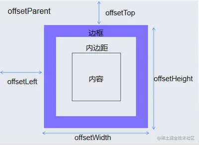
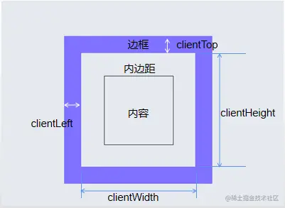
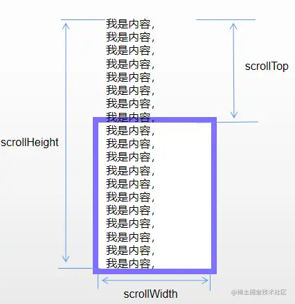

> DOM(Document Objecr Model)是指将HTML文档转换为对象，方便对网页元素进行操作。
> M（Model）代表模型，即描述HTML文档每个部分之间结构和关系所构成的综合模型

**网页中的每个内容都是一个节点（node）**

1. 文档节点（document）
2. 元素节点（element）
3. 属性节点（attribute）
4. 文本节点（text）
5. ...

这些节点共同继承自`Node`类。在DOM中，节点之间以树形结构进行关联，以模拟HTML文档的结构

**document对象的原型链 :** 

​	HTMLDocument -> Document -> Node ->EventTarget -> Object.protoType -> null

# 1. 获取元素节点

可以使用以下方法获取HTML文档的元素节点

| 获取方法                                                    | 描述                                                         |
| ----------------------------------------------------------- | ------------------------------------------------------------ |
| `getElementById(id)`                                        | 通过ID获取单个元素节点                                       |
| `getElementsByClassName(class)`                             | 通过类名获取一组元素节点                                     |
| `getElementsByTagName(tag)`                                 | 根据标签名获取一组元素节点                                   |
| `getElementsByName(name)`                                   | 根据name属性获取一组元素节点，适用于表单元素                 |
| `querySelector(selector)`<br />`querySelectorAll(selector)` | 根据选择器选取符合条件的第一个元素节点<br />选取所有符合条件的元素节点，返回类数组对象 |

> 获取到的类数组元素对象,除了`querySelectorAll`,其他都会实时更新

# 2. 通过元素获取其他节点

> 可以通过`元素节点.getElementByxxx/querySlector`,获取后代节点

也可以使用以下属性/方法进行访问：

| 属性/方法                                                    | 作用                                                        |
| ------------------------------------------------------------ | ----------------------------------------------------------- |
| `el.childNodes`<br />`el.children`                           | 所有**子节点**(包括文本节点/幽灵节点)<br />所有的**子元素** |
| `el.firstChild`<br />`el.firstElementChild`<br />`el.lastElementChild` | 第一个子节点<br />第一个子元素<br />最后一个子元素          |
| `el.nextSibling`<br />`el.nextElementSibling`<br />`el.previousElementSibling` | 后一个兄弟节点<br />后一个兄弟元素<br />前一个兄弟元素      |
| `el.parentNode`<br />`el.parentElement`                      | 父节点<br />父元素                                          |
| `el.tagName`                                                 | 标签名                                                      |

<span style="font-size:20px">**获取/修改属性节点(查/改) :**</span>

可以使用以下方法读取或修改元素节点的属性：

|             方法              |               描述                |    参数     |
| :---------------------------: | :-------------------------------: | :---------: |
|    `el.getAttribute(attr)`    |        读取元素节点的属性         |    attr     |
| `el.setAttribute(attr,value)` |        设置元素节点的属性         | attr，value |
|  `el.removeAttribute(attr)`   |        移除元素节点的属性         |    attr     |
|    `el.replaceWith(attr)`     |        用元素替换当前元素         |    attr     |
|           `el.xxx`            |        获取或修改属性节点         |     无      |
|        `el.className`         | 不推荐使用，获取或修改 class 属性 |     无      |

> 在 HTML 中可以自定义属性，定义方法如下：
>
> 1. 写作 data-属性名 的格式
> 2. 自定义属性会保存在 dataset 对象中，可以通过 `ele.dataset.属性名` 获取。

<span style="font-size:20px">**获取/修改文本 :**</span>

可以使用以下属性获取/修改元素节点的文本：

- `el.textContent`：获取元素中的文本内容，不考虑CSS样式
- `el.innerText`
  1. 获取元素中的文本，会考虑CSS样式，会触发网页的重排
  2. 当修改的文本内容有标签时，会自动将标签转义
- `el.innerHTML`：获取或设置元素中的HTML代码，可以直接插入HTML代码
  - innerHTML插入内容时,有xss注入风险

<span style="font-size:20px">**创建/插入元素节点(增)**</span>

|                   方法                   |                      描述                      |
| :--------------------------------------: | :--------------------------------------------: |
|         `el.createElement(元素)`         |       创建一个新元素，返回一个节点对象。       |
|          `el.appendChild(元素)`          | 将元素添加到任意元素中，作为它的最后一个子元素 |
|     `el.insertBefore(元素,目标节点)`     |           将指定元素插入指定子元素前           |
| `el.insertAdjacentElement('位置', 元素)` |              将元素添加到任意位置              |

  `insertAdjacentElement`具体的位置参数说明如下：

  - `beforeend`/`afterbegin`：在元素的最后一个子元素之后（`beforeend`）或第一个子元素之前（`afterbegin`）添加元素。
  - `beforebegin`/`afterend`：在当前元素之前（`beforebegin`）或之后（`afterend`）的同级元素中添加元素。

<span style="font-size:20px">**删除 :**</span>

`el.remove()`删除当前元素

<span style="font-size:20px">**节点复制 :**</span>

`el.cloneNode(true)` 复制当前节点,包括该节点所有的属性

- 只会复制当前节点,并不会复制子节点
- 传入参数代表是否复制子节点

# 3.CSS样式读取/修改

| 方法                                   | 描述                                                         |
| -------------------------------------- | ------------------------------------------------------------ |
| `el.style.样式名`                      | 获取/修改元素的行内样式                                      |
| `getComputedStyle(el,[伪元素]).样式名` | 获取元素的计算样式                                           |
| el.style.serProperty('样式名','值)     | 设置样式的值(可获取[css变量](../02-CSS/07-补充内容.md#2.css变量)) |
| el.getPropertyValue('样式名')          | 获取对应实行的值                                             |

获取元素行内样式设置的的 CSS 变量

`element.style.getPropertyValue("--my-var");`

获取元素内联/外联样式设置的的 CSS 变量

`getComputedStyle(element).getPropertyValue("--my-var");`

## 读取/修改class类名

| 方法                    | 描述               |
| ----------------------- | ------------------ |
| `el.className`          | 读取/修改class     |
| `el.classList.add()`    | 添加一个或多个类名 |
| `el.classList.remove()` | 移除一个或多个类名 |
| `el.classList.toggle()` | 切换类名           |

# 4.offset、client与scroll

## 3.1-offset系列

元素偏移量offset,相关属性可以获取该元素的位置(偏移),大小等



1. `el.offsetParent` 获取元素带有定位的父元素
2. `el.offsetTop/Left` 获取元素相对定位元素的垂直/水平偏移量(距离)
3. `el.offsetHeight/width ` 获取元素的整体高度/宽度,border+padding+content

## 3.2-client系列

元素可视区client系列,通过相关元素可以获取该元素的边框大小,元素大小等



1. `el.clientTop/Left` 获取元素的上/左边框宽度
2. `el.clientHeight/width` 获取该元素padding+content的宽度/高度,不含边框

## 3.3-scroll系列

元素滚动scroll系列,相关属性可以获取/修改滚动距离,元素大小



1. `el.scrollTop/Left` 获取/修改元素的垂直/水平滚动条滚动距离
2. `el.scrollWidth/Height` 获取元素实际高度,包含溢出部分+上左padding

### 浏览器窗口相关：

1. 获取浏览器视口大小

```javascript
document.documentElement.clientWidth/Height
window.innerWidth/Height 
```

2. 获取元素距离视口的位置`el.getBoundingClientRect()` 

   返回一个对象:

   1. width/heigth = 元素本身 padding + width/height
   2. top(y)/bottom 元素上下边框,距离视口顶部距离
   3. left(x)/right 元素左右边框,距离视口左侧距离


3. 滚动条平滑过渡:

```css
html { 
    scroll-behavior: smooth; 
}/*css样式*/
```

```js
window.scroll({
    left,
    top，
    behavior: "smooth"
})//使用js属性
```

4. 获取浏览器滚动距离

```js
// 滚动条滚动距离
let sct = document.documentElement.scrollTop || document.body.scrollTop || window.pageYOffset
```


# 5. 事件

1. 事件就是用户和页面之间发生的交互行为

2. 绑定响应函数的方式:

   1. 直接在元素标签中添加事件

      ```html
      <button onmouseclick="alert('点我!')"</button>
      ```

   2. 通过为元素指定属性设置回调函数形式(一个事件只能绑定一个响应)

   3. 通过元素`addEventListener(事件类型,事件处理程序,[事件捕获])`方法来绑定事件

## 事件对象(event)

事件对象是由浏览器在触发事件时创建的对象

- 这个对象封装了事件相关的各种信息
- 事件对象,可以作为响应函数的参数传递(event)

DOM中存在多种不同的事件对象，有着一个共同的祖先 `Event`

| 属性                              | 描述                                     |
| --------------------------------- | ---------------------------------------- |
| `e.type`                          | 触发事件的类型                           |
| `e.target`<br />`e.currentTarget` | 触发事件的DOM对象<br />绑定事件的DOM对象 |

## 事件委派(委托)

```html
<ul>
    <li></li>
    <li></li>
    <li></li>
</ul>
```

```js
let ul = document.querySelector('ul')
ul.addEventListener('click',(e)=>{
	console.log(e.targer)
})//只需要绑定一次，即使是新添加的li，也可以触发事件
```

## 事件冒泡(bubble)

事件的冒泡就是指事件向上传递,

当元素的某个事件触发后,其祖先元素上的相同事件也会被同时触发

使用`e.stopPropagation()`取消事件冒泡

事件冒泡和html结构有关,与样式无关

## 取消事件默认行为

1.  `return flase`
    - 只能在`xxx.xxx = function(){}`这种形式下使用
2.  使用`e.preventDefault()`,来阻止默认行为(推荐使用)

## 事件捕获

1. 事件传播机制：

   在DOM中，事件传播可以分为三个阶段

   1. 捕获阶段（由祖先元素向目标元素进行捕获）默认情况，事件不会在捕获阶段触发
   2. 目标阶段（触发事件的对象）
   3. 冒泡阶段（由目标元素向祖先元素进行冒泡）

2. 事件的捕获：

   值事件从外向内的传导

   当前元素触发事件后，会先从当前元素最大的最先元素开始向当前元素开始进行事件的捕获

3.  需要再捕获阶段触发事件，可以将`addEventListener`，第三个参数传`true`

4. 可以使用`e.eventPhase`查看事件触发阶段

# 6.补充内容

1. 元素内容是否可编辑

```js
document.designMode = 'on'
```

```css
.box{
    contentEditable:true
}
```

2. 元素全屏展示

   1. `document.fullscreen` 该属性存储全屏状态

   2. `document.exitFullscreen()` 退出全屏

   3. `el.requestFullscreen()` 该方法可以使元素全屏展示

   4.  [css全屏状态选择器](../02-CSS/01-CSS基础.md#伪类选择器) 
   
   > 注意:获取全屏状态和退出全屏时,应使用`document`来获取对应状态

