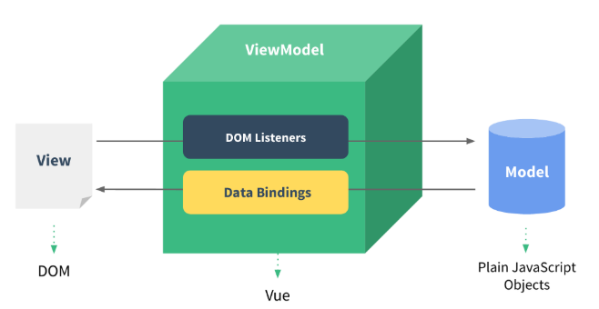

# vue入门

> Vue是一个轻量级的前端框架,[VUE2官方文档]([介绍 — Vue.js (vuejs.org)](https://v2.cn.vuejs.org/v2/guide/))

## 认识MVVM模型

> MVVM是一种软件架构模式，它可以让视图（View）和模型（Model）之间实现双向绑定，即视图的变化会自动反映到模型中，模型的变化也会自动更新到视图中。

- M模型(model)：表示数据，对应Vue中的`data`选项，它是一个对象，包含了应用程序的状态和逻辑。

- V视图(View)：表示用户界面，对应Vue中的**模板**，它是一段HTML代码，可以用模板语法来显示数据和绑定事件。

- VM视图模型(ViewModel)：表示视图和模型之间的桥梁，对应Vue中的**实例**，它是一个对象，负责监听模型的变化并更新视图，以及处理视图的交互并更新模型。

就Vue而言:

1. data中所有的属性,最后都出现在vm身上
2. vm身上所有的属性及Vue原型上所有的属性,在Vue模版中都可以直接使用



## 初识Vue

> *[Vue下载链接](https://v2.cn.vuejs.org/v2/guide/installation.html),引入Vue的Js文件后，就可以使用全局的Vue构造函数来创建Vue实例。*

1. 需要`Vue`工作,必须创建一个`Vue`实例,并传入一个配置对象,

   创建`Vue`实例时，需要传入一个配置对象，包含`el`、`data`...选项。

2. `root`容器中的代码被称为**[Vue模版]**

3. 在root容器中使用`{{xxx}}`来插入数据,其中`xxx`要写成js表达式

   root容器中的代码仍然遵循HTML规范,只不过混入了特殊的Vue语法

### 一个简单的小案例:

html代码:

```html
<div>
    <h1>
         <!--在h1标签中使用模版语法来显示message数据-->
    	{{message}}
    </h1>
</div>
```

js代码:

```js
Vue.config.productionTip = false //关闭Vue在启动时生成生产提醒
//创建一个Vue实例，并传入一个配置对象
const app = new Vue({
    //指定Vue实例要管理的容器，可以是CSS选择器(推荐)或者DOM元素(不推荐)
    el:'选择器',
    //data中用于存储数据,数据可以在模版中使用
    data(){
        //函数式写法
        return{
            message:'你好,世界!'
        }
    }
})
```

> ***一个Vue实例只能管理一个容器**，如果需要管理多个容器，可以创建多个Vue实例或者使用组件化开发。*

## data与el的两种写法

1. el:
   1. 创建Vue实例的时候配置el属性
   2. 先创建Vue实例,随后通过`vm.$mount('#root')`指定el值
2. data:
   1. 对象式
   2. 函数式

> 由Vue管理的函数,一定不要写箭头函数,因为其this不指向自身实例

## Vue的配置项

1. template 模版内容
2. el 绑定的容器
3. data 存储的数据
4. methods [存储的方法](./02-模版与指令语法.md#2.事件绑定)
5. computed [计算属性](./03-计算属性与监视.md#计算属性computed)
6. watch [侦听属性](./03-计算属性与监视.md#监视属性watch)
7. props 接收传入数据
8. filters [过滤器](./05-过滤器.md#过滤器)
9. directives [自定义属性](./02-模版与指令语法.md#三、自定义指令)